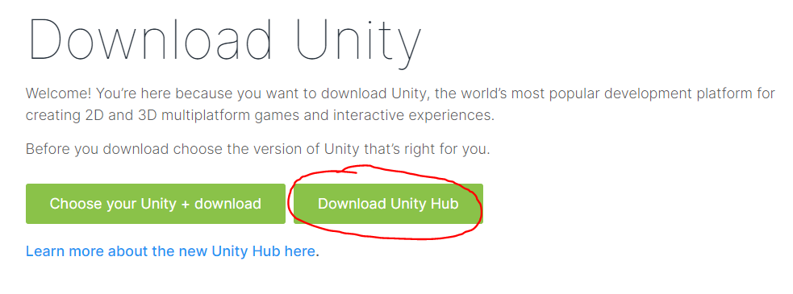
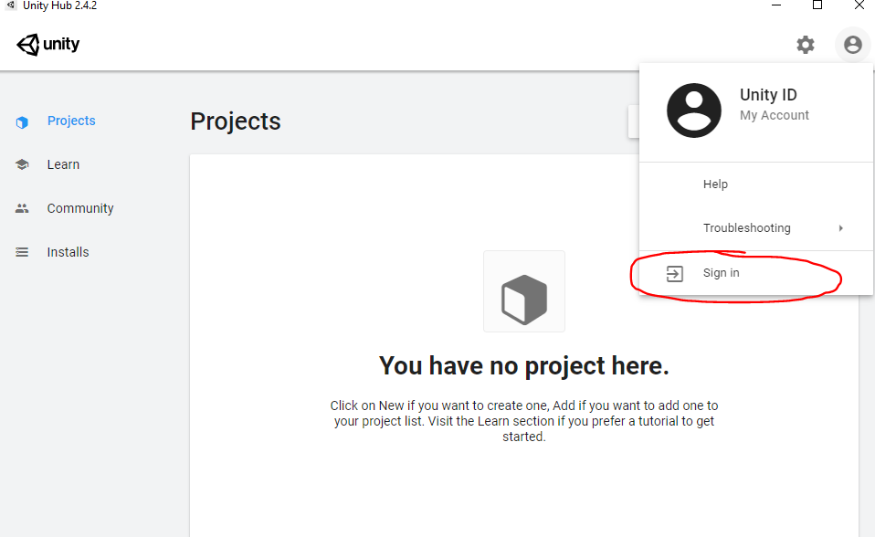
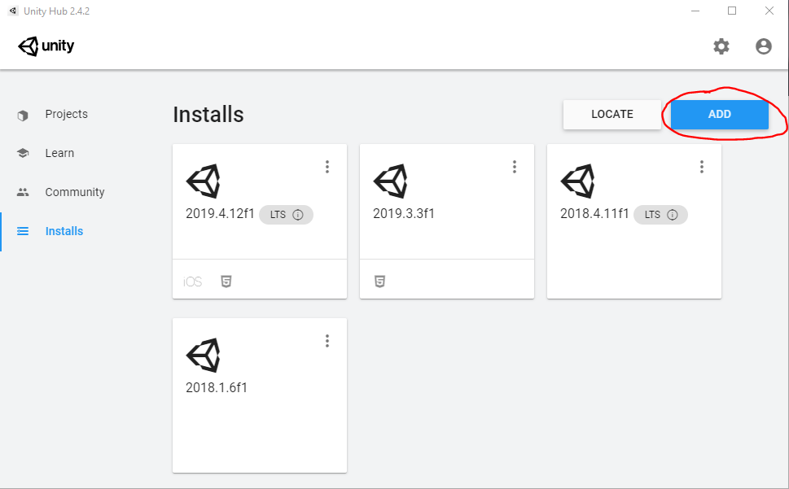
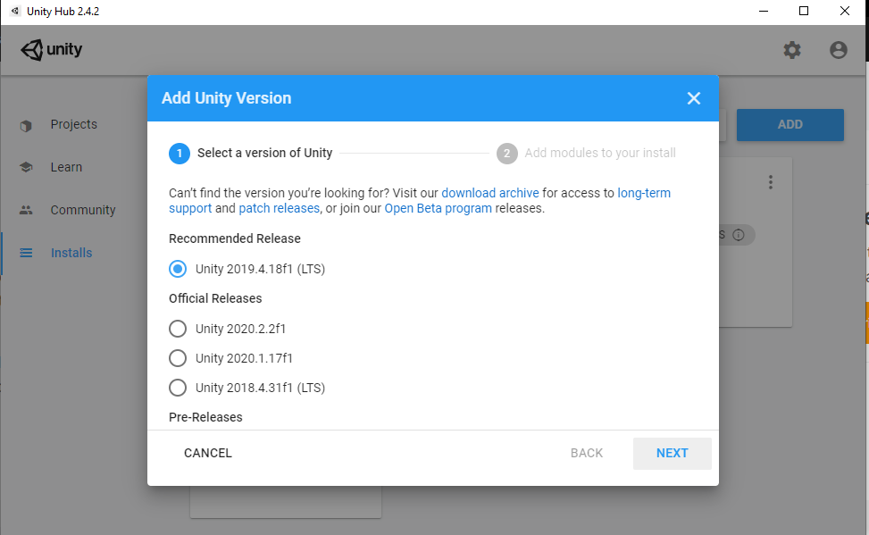
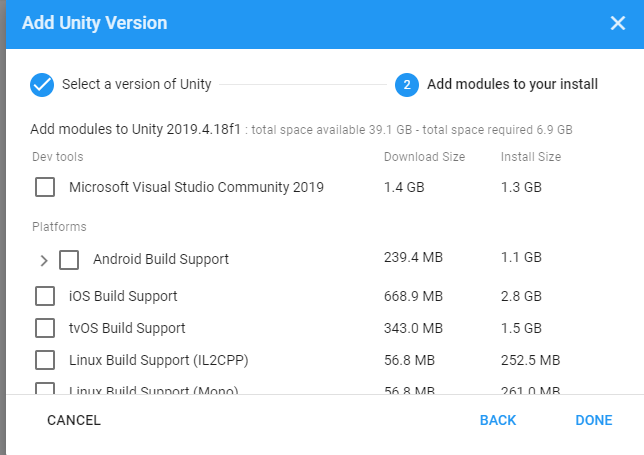
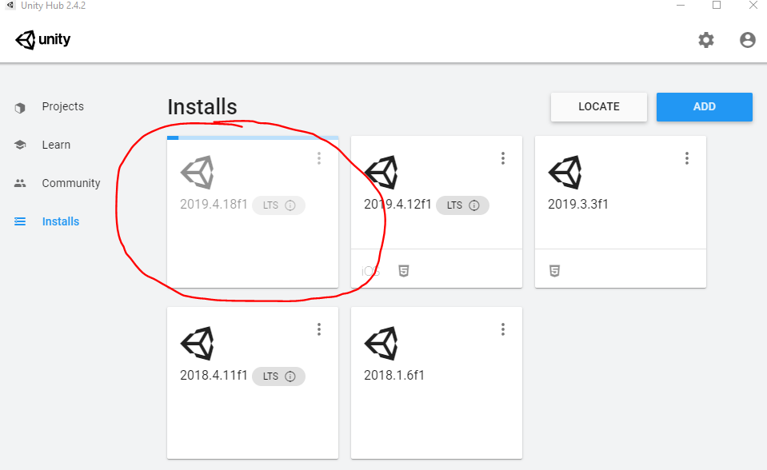

# 2. Introduction To Unity

## What is Unity3D? 

Remember from last section when we talk about VR as an *immersersive, simulated world*? Well, to make a realistic environment that satsifies all the requirements, you need many components, from physics and lighting to 3D objects and sound. Once you finish develop your world, you need to consider VR integration and platforms, and list goes on. In other words, ***it is very complicated to create a world***. Fortunately, game engines take care of the behind the scene stuff so you as a developer can focus on creating your unique experiences. 

Two of the most popular game engines for VR development are [Unity3D](https://unity.com/) and [Unreal Engine](https://www.unrealengine.com/en-US/). For this VR development course, we will be focusing on Unity3D, which is easier to operate, more commonly used, and supports wide variety of platforms.  

If the name Unity doesn't ring a bell with you, I'm sure you at least heard of one of the games developed on Unity!
- Hearthstone: Heroes of Warcraft
- Assassin's Creed Identity
- Temple Run
- Rust 
- Fall Guys
- And many more (hopefully one of your games too!)

## Get Started 
Now that you have an understanding of what Unity is and what you can do with it. Let's get started! 

1. ### Download Unity Hub
    Unity Hub is a platform where you can manage all the Unity projects and their different versions. Go to Unity website (https://unity3d.com/get-unity/download) and "Download Unity Hub"
    
    
  

2. ### Sign In and Download Unity
   Now that you have Unity Hub installed, you are one step closer to building your VR experience. Run Unity Hub and click on the top right icon to sign in. You might be qualified for free Unity Education license, check out [here](https://unity.com/education/license-grant-program). 
   
   
   Next step is the real deal: install Unity! Go to "Installs" on the left panel and click on "Add". Your install page is probably blank at the moment, and that's okay.

   

   For this tutorial, we will install `Unity 2019.4.18f1 (LTS)`. New Unity versions might come out but make sure to install the version with (`LTS`). LTS stands for ***Long Term Support***, which means Unity will continue to bug fix and support for two years after the release date. This is helpful because you can continue developing your project without worrying about version issues.

    

    Next step is adding modules to the Unity install. Depending on your preference, you can install Visual Studio or Visual Studio Code (download [here](https://code.visualstudio.com/)). If you any further question regarding which module to get, refer to the [Q&A section](#common-qa). *(Tips: Remeber to select "Andriod Build Support" if you are developing on Oculus Quest)*

    

    Once if you finish selecting the modules, hit "Done". A downloading Unity should appear and you are on your way to become a VR developer! 

    
  

1. ### Some Helpful Resources
    While Unity is downloading, here are some resources that can get you started.
    - [Unity Learn](https://learn.unity.com/): A compilation of tutorials made by Unity
    - [Unity Tutorial by raywenderlich](https://www.raywenderlich.com/unity/paths/learn): A website that is very helping for gettign started on Unity
    - [Unity Documentation](https://docs.unity3d.com/Manual/index.html): Offical Unity documentation

## Common Q&A
1. What's the difference between Visual Studio and Visual Studio Code?

    Even they they share very similiar names, they are quite different. Visual Studio is known as an IDE (***Integrated Development Environment***), which is capable of running and building applications, and it takes up more space (around 3 GB). By contrast, Visual Studio Code, often refers to as VSC, is a text editor that only takes about 250MB and there are many plugins that allow you to do various things from web to mobile development. Though Visual Studio is the default editor for Unity, since Unity has its own compiler, either one will work.   

2. What module do I need?
   
   - Always install `Documentation` since it will be very handy during development
   - If you are building Augmented Reality (AR), Oculus Quest, or Google Cardboard apps for Andriod device, install `Andriod Build Support`.
   - If you are building AR or Google Cardboard apps, install `iOS Build Support`
   - If you are build desktop VR apps, you don't need to install anything.
