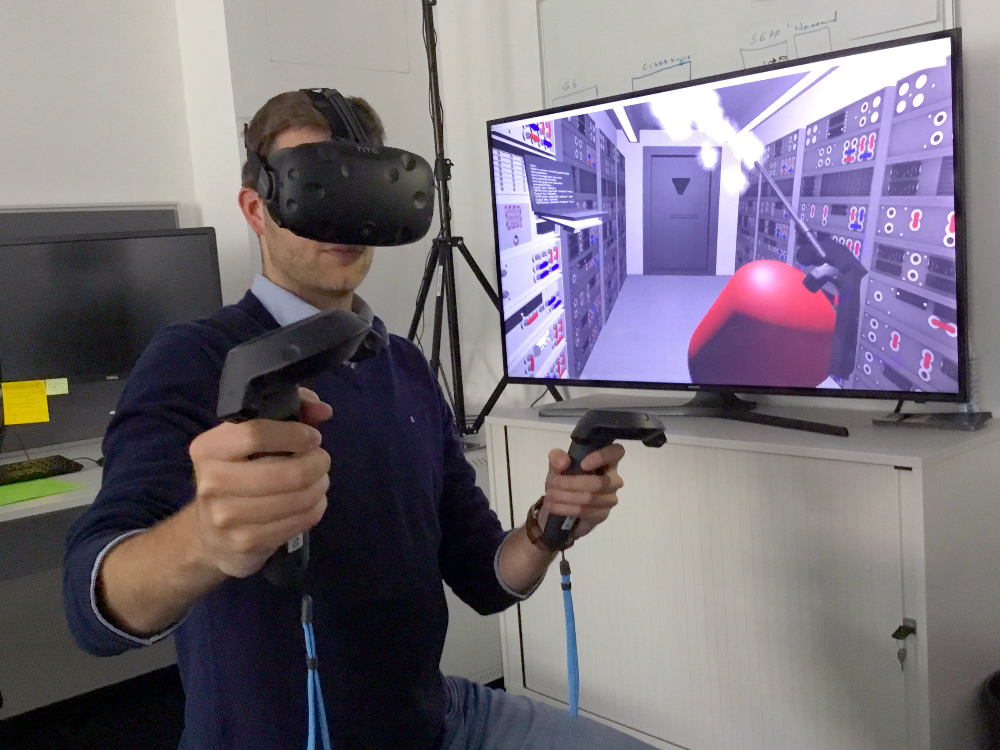
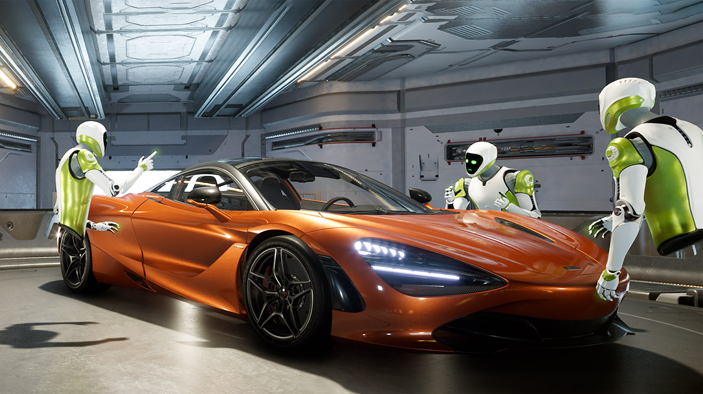
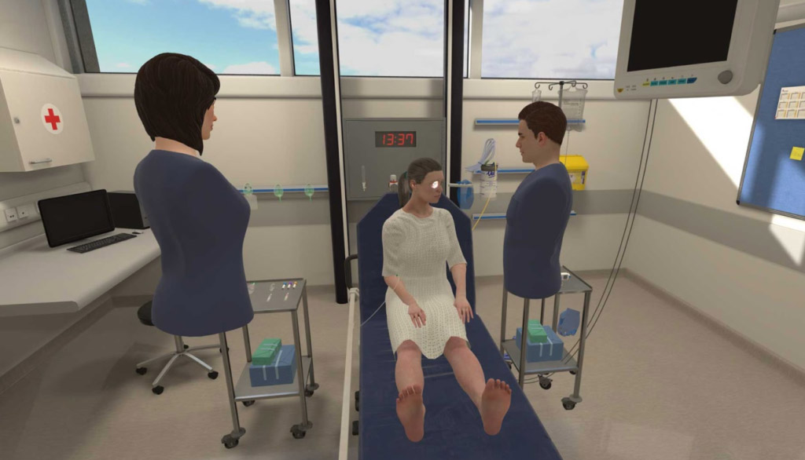
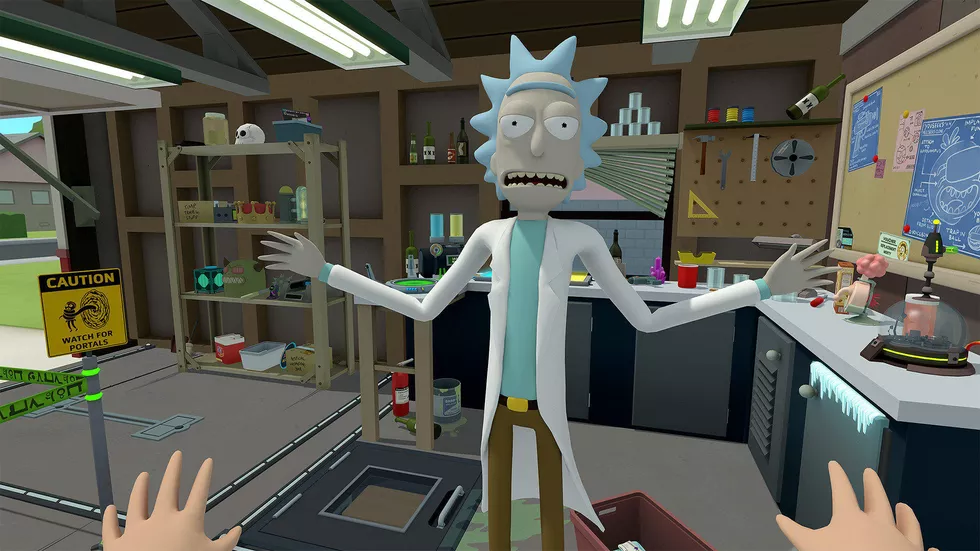

# 1. Introduction to Virtual Reality

  

## What is Virtual Reality?
What is your wildest dream like? Is it singing with your favoraite artist on stage? Is it watching your favoraite sport team on a courtside seat? Or is it working with aliens on a intersteller mission? As wild as they may sound, they are all possible thanks to a technology called **Virtual Reality**. 

Virtual Reality, as its name suggests, is an ***immerserive, simulated world***. There are three key component to this three-word definition that sets VR apart from any other experiences. 
- *Immersive*: In order to for an virtual world to be immersive, you should be able to move and even interact with it by moving your physical body. For example, if you turn your head to the right, you should see the objects on your right.
- *Simulated*: Very often the virtual world is computer generated or captured by a 360 degree camera to provide a surrounding experiencce.
- *World*: A world should be three dimensional and its components should be responsive to your interaction as if you are actually in the space. For instance, if you are walking toward a playing speaker, the sound of the speaker should be louder as you get closer. 
    
    

  

## Why Should I Care About this Virtual Reality?
Besides from fulfilling your wildest dream (which should be a good enough reason already!), there are also many practical uses for virtual reality. Because of its ability to fully immerse users into virtual envirnoment, unbounded by any constraint, VR is the perfect place for simulation, prototyping, or just having some out of this world (*pun intended*) fun! Here are just some common applications of VR, and there are many more opportunities for you to discover.

##### Train astronauts to operate space shuttles

  

##### Prototype the latest car models

  

##### Perform and practice medical operations 

  

##### Our favoriate: meet Rick from *Rick and Morty*! 

  

## Next Step
Ready to create your virtual reality experience? Buckle up and check out [Introduction to Unity3D](/IntroductionToUnity.md)

