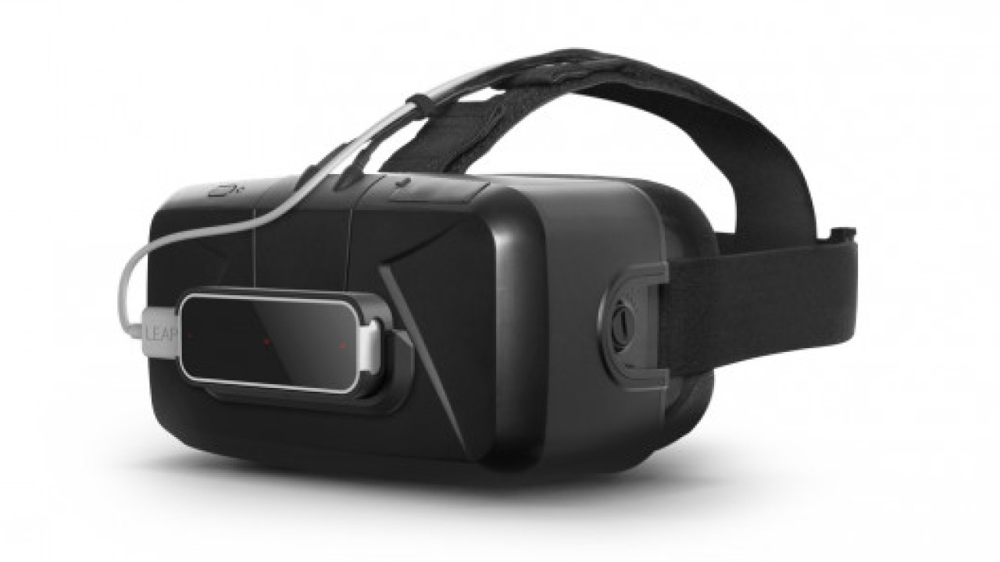

# 6. Leap Motion in Unity

  

## What is Leap Motion?
Leap motion (now part of Ultraleap) is a company that makes finger tracking software and hardware. To simply put, it brings your hands into the computer so you can do cool things like this: 

or this:

Cool right? In this section, we will learn about this technology and have some "hand-on" (pun intended) experiences with it.

## Why Finger Tracking?
What is the point of finger tracking if you can do pretty much everything with controllers? Glad you ask, here are some reasons why the best controllers is your hands.
- ***Easy to Learn***: When you pick up a VR controller, you need to learn about what each button does and get used to the mapping. On the other hand, everyone knows how to manipulate objects with their hands in the real world which makes it easier to transfer those skills into VR.
- ***More Immersive***: What feels more natural than being able to look down, see your hands and interact with virtual object with them? Virtual hands tricks your bain into thinking everything is real and therefore provide deeper immersion.
- ***More Possibilities***: With VR Controllers, you have to press certain buttons to make certain gestures. In addition to not being immersive, it also limits the  users to only a number of gestures. With hand tracking, you have potentially infinite possibilities that you can do with just your hands.

Thanks to the reaons listed above and more, Leap Motion is a core element of Holos. Feel free to check out this [blog post](https://blog.holos.io/why-were-going-all-in-with-leap-motions-interaction-engine/) by our CTO Josh on why we choose Leap Motion. 

## Getting Started
Before implementing hand tracking in Unity, there are a few things you need to get this awesome technology working. 

### 1. Get the hardware ready
First of all, make sure you have your [Leap Motion Controller](https://www.ultraleap.com/product/leap-motion-controller/#overview) ready. Next, stick the controller on your VR headset with double-sided tape or use a [Leap Motion Mount](https://www.ultraleap.com/product/vr-developer-mount/). And the result would look something like this: 

 

### 2. Get the software ready
Awesome! Next step is to install the drivers and softwares needed for running Leap Motion. 

- Download the Leap Motion drive. I highly recommend downloading the [Gemini(V5)](https://developer.leapmotion.com/gemini-v5-preview) version. Even though it is in Beta mode, its capability is siginificantly better than the previous version, Orion(V4), or any other existing hand tracking technology.
- Download [Leap Motion Unity Modules](https://developer.leapmotion.com/unity) based on your Unity version. 
- While you are downloading everything, make sure to check out [Leap Motion's SDK](https://leapmotion.github.io/UnityModules/index.html) and see how things work.

 

### 3. Install Leap Motion Driver
Extract the downloaded Leap Motion software and open the folder. You should see an exe file called `Ultraleap_Tracking_Software_Setup` and click on it. An install window should pop up and guide you through the installation procss. 

(*Tip: If Windows Firewall warns you about the application, as long as you download the software from Ultraleap's official website, you can ignore the warning and continue*)
After installing, when you run the driver, you should see something like this. This will be the control panel for your Leap Motion Controller.

 

### 4. Install Leap Motion Unity Modules
One last thing to install! Once the Unity modules finish downloading, extract the folder and you should see three UnityPackages called `Core`, `Hands`, and `Interaction Engine`. [Leap Motion's SDK](https://leapmotion.github.io/UnityModules/index.html) should tell you what each one does. I recommend importing all three packages. 

To import Unity packages, go to the dropdown panel, select Assets-->Import Package-->Custom Package. 

A window should pop up and prompt you to select an unitypackage. Navigate to the folder where you have the extracted Unity Module and select one of three packages. Click "Open" and an import window should show up. Click "Import" and you just imported your first Unity package!

Do the same thing for the other two unitypackages. After you're done, pat yourself on the back because you just finished setting up everything needed to run Leap Motion in Unity! 

 

### 5. Time for Some Hands-on Fun!
Great job! Now it's finally Leap Motion time! Once you finished importing the Unity module, you should see a `Plugins` folder appear in the Assets folder. Navigate to Assets-->Plugin-->Modules-->InteractionEngine-->Examples to find out some cool demos for you to play around. I highly recommend checking out each one. Pay attention to how everything is structed and how the interaction is different from those of typical controllers VR.

Here are some of my favoriate demos!

*Interaction Objects*

*Dynamic UI*

 

### 6. More Leap Motion Resources 
Want even more things to play around with your hands in VR? The [Leap Motion Gallery](https://gallery.leapmotion.com/category/vr/) is the perfect place to check it out! There are a number of Leap Motion projects for you to explore the potential of this amazing technology. Here are some of my favoriates:
- Blocks: https://gallery.leapmotion.com/blocks/
- Shortcuts: https://gallery.leapmotion.com/shortcuts/
- Cat explorer: https://gallery.leapmotion.com/cat-explorer/
- And many more! 