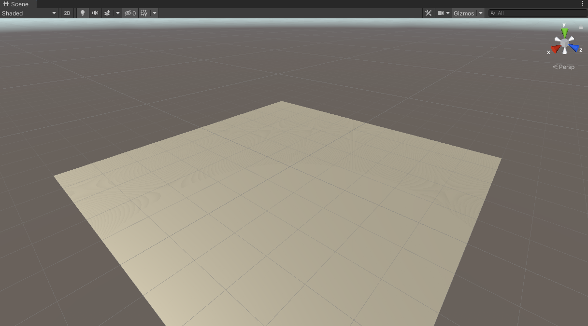
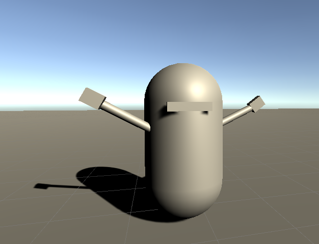
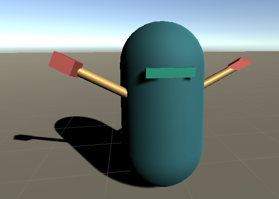
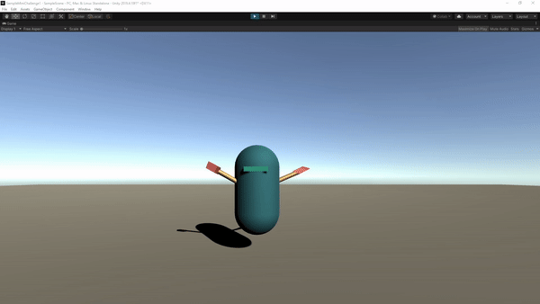

# Mini Challenge 1: Get the Party Started!

  

## Introduction
By now you should have some ideas of how Unity and Git works. I'm sure you are exicted to get your hands dirty. Alright, time for a challenge! In this challenge, each one of you will create a character that moves around and use Git to gather all the characters in one place!  

## Stages 
### Stage 1: Create a repository
In this stage, you will practice initializing a team project and getting everyone on board. 
1. Come up with a team name! 
2. Communicate with your team and create one repository for the entire team. The name of the repo should be something like "TeamName_MiniChallenge_1".
3. Initiate a 3D Unity project in the repo and add a plane to the scene, because we need a place for our Unity party!
4. Don't forget to add Unity `.gitignore` to your project: https://github.com/github/gitignore/blob/master/Unity.gitignore
5. Add everyone to the repository.
6. Everyone should be able to clone the repository and see the plane on their computers. Something like this:

    
7. In order for prevent code version conflicts, everyone should create his/her own branch based off the main branch (the `master` branch).

### Stage 2: Build a character
Awesome! Now you are ready to build your first virtual character. Get creative and go crazy! 

1.  Make sure everyone's repository is update with the master branch.
2.  Build a character on the plane using only primitives (simple 3D objects provided by Unity). Here is a simple example I created. You can create anything you want -- it doesn't even have to be a human! 
   
    
3.  To make our character more interesting, let's add some materials to the primitives. This is my example -- I'm creating a futurstic robot that just won a boxing match! 
   
    

### Stage 3: Make it move
Great job on building your first character! It looks cool but it seems to be missing something... Oh yeah, let's make the character move! 

1. Create code and add motion to your character. It can be anything, changing colors, walking around etc. My robot is jumping because it is celebrating its victory! Here is the [my script]("/Scripts/Jump.cs") that you can refer to.

    

### Stage 4: Time to Party!  
By now, you have mostly being work alone on your branch. Curious what your teammates have been up to? Time to gather everyone's progress together and have a little fun! 

1. Commit and push your updates to your branch.
2. Merge your branch into the master branch (*tips: communicate with your team so not everyone is merging at the same time*)
3. Once everyone merges with the master branch, check out the master branch and see what everyone's character in the same scene!