# 5. Virtual Reality in Unity

  

## Time for Some VR Fun!
Congrats on making it this far and hope you enjoyed making your own dancing avatar! Now we can dive into the part you are mostly excited about: Virtual Reality! The good news is: Unity has a very nice and easy VR integration for developers like you and me. Follow this tutorial and create your first VR experience! 

 

### 1. Start a new Unity project
By now you should have an idea on how to create a new Unity project. Just in case if you forgot, check out [the tutorial here.](IntroductionToUnity.md). Open Unity Hub, select "New", and create a 3D project. I'm going name mine "VRDemo".

 

### 2. Challenge: Develop the scene a bit more!
Drawing from your knowledge of creating a scene from the last mini-challenge, let's make a scene that is more interesting! Feel free to get creative with it.

So here is my super simple scene consisted of a box and a tree made of a sphere and a cylinder.

.

### 3. Enable VR in Unity
Depending on the device you have available, choose one of the three options below (*tip: HMD means Head Mounted Display, or your VR headset*).

1. [PC-Powered HMD](#PC-Powered-HMD)
2. [Oculus Quest](#Oculus-Quest) 
3. [Without HMD](#Without-a-HMD)

 

## PC-Powered HMD

### 1. Enable VR in Unity
Next, follow this [offical guide](https://learn.unity.com/tutorial/enabling-vr-1#5fd69c9cedbc2a1685e10ed5) provided by Unity to enable VR in your project. Once you're done, if you put on your VR headset, you should be able to rotate your head and see the scene. Something like this: 

.

 

### 2. Seeing your scene in VR
Once your scene is done, put on your headset and witness the wonders you created! 

.

 

## Oculus Quest
Developing on a Quest is quite a bit different from developing on a HMD. Since Quest has its own Andriod operating system, the development process will feel more like making an Andriod app. Don't worry, we will teach you how in this section.

### 1. Install Android Module 
If you follow the [Introduction to Unity](IntroductionToUnity.md) tutorial, you should have already installed the Andriod Module in Unity Hub. If not, close Unity, open Unity Hubm and follow the GIF below. 

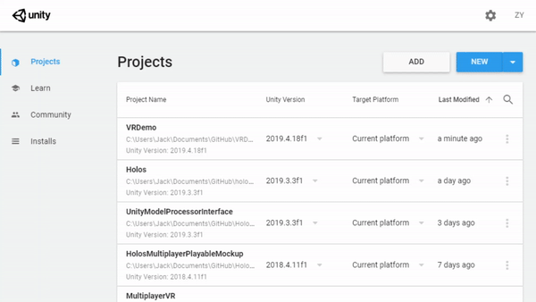

### 2. Set up Quest

While Andriod Module is downloading, let's make sure our Quest is ready for developing. Here is a quick checklist:
- Enable developer mode
- Allow USB Debugging for Quest

If there is any further question, refer to [the document by Oculus](https://developer.oculus.com/documentation/unity/unity-enable-device/) for more information 

### 3. Enable VR in Unity

First, enable VR for your project by going to `Edit->Project Setting->Player->XR Settings` and check "Virtual Reality Supported". 

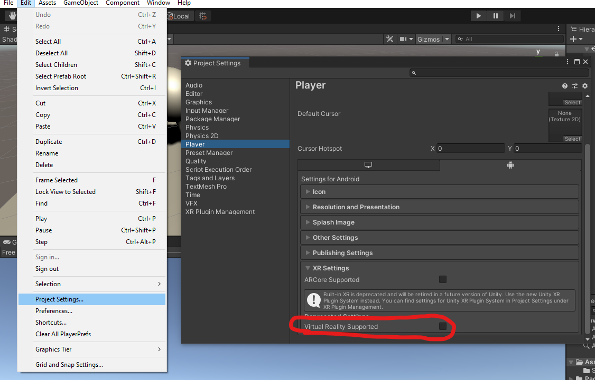

If Unity doesn't automatically add Oculus SDK, click on the add buttton and manually select "Oculus"

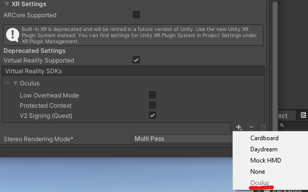

Once that is done, scroll up to `Other Settings`, still under Player Setting, and change the order of graphics API by dragging the toggle so that `OpenGL` comes before Vulkan. This is just because Vulkan is not supported in VR at the moment.

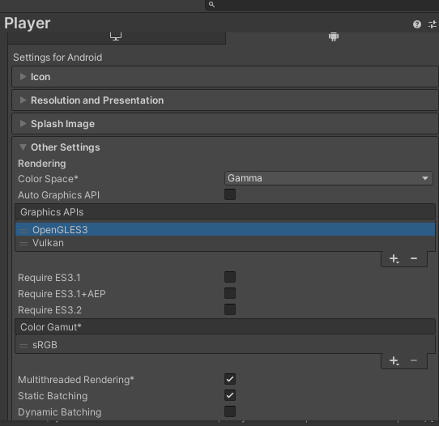

### 4. Select your Quest in Build Setting
Open Build Setting in the dropdown menu, and click "Add Open Scene" to add the scene you just constructed.

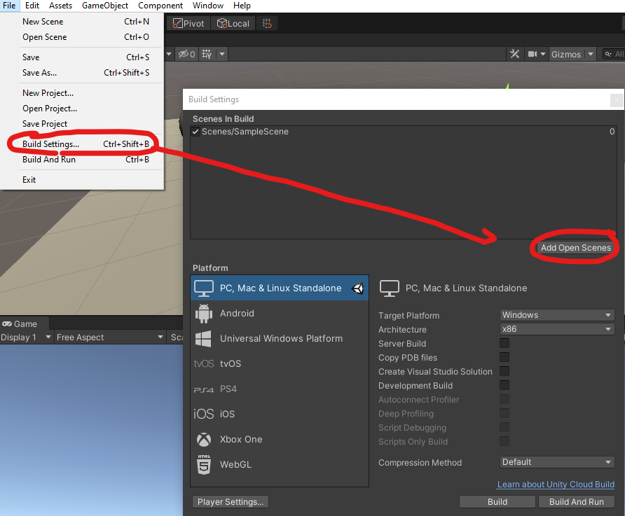

Next, connect your Quest headset to your computer via Oculus Link and make sure it is turned on. Click "Andriod" in the platform section and you should select your Quest device in the `Run Device` dropdown. 

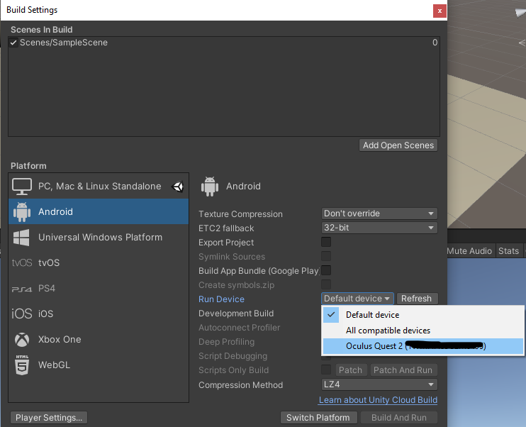

### 5. Switch Platform

Then, simply click "Switch Platform" on the bottom right. After a while of compiling, you should see something like this:

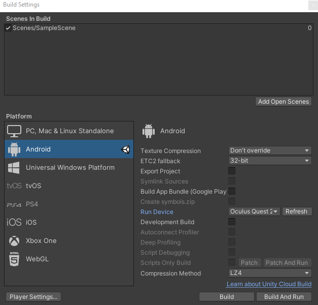

### 6. Build and Run Your Project! 
Now you are getting incredibly close! Select `Build and Run`. You will be prompted to see name the build file. Enter a name and let it build! 

After the project finishes building, put on your headset, go to `Apps->Unknown Sources->Your Unity Project` and celebrate your first VR project! 

 

## Without a HMD
No headset no problem! Here is how you can simulate VR in Unity even without a HMD.

### 1. Install XR Pluging Management
Open Project Setting in the dropdown menu (`Edit->Project Setting`).

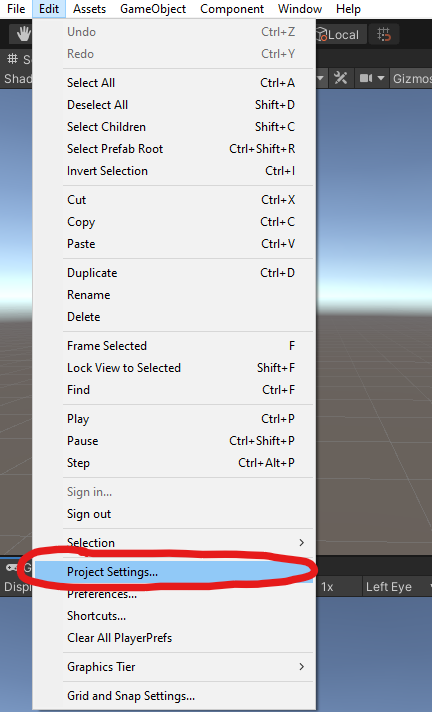

And a window pops up and on the left you should see a "XR Plugin Management" tab, and click "Install XR Plugin Management".

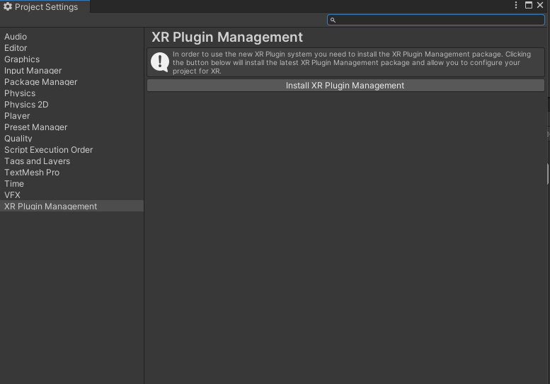

 

### 2. Enable Mock HMD
After you install XR Plugin Mangement, you should see a list of plug-in providers and enable `Unity Mock HMD`.

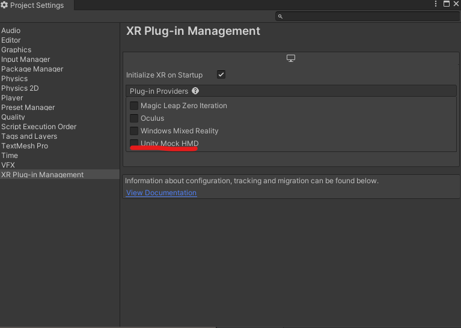

 

### 3. Seeing your scene in VR
Once you enable Mock HMD, go back to the scene you just created and click play. You should see something like this:

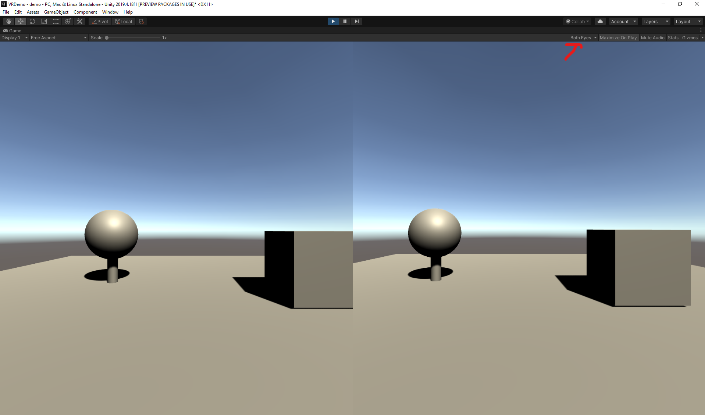

Why are there two identical views? That is what each eye would see if you have your HMD! You can even change the view on the top right corner from "Both eyes" to either left or right eye.

 

### 4. Adding Interactions 

Congrats on making your first VR experience! You may notice that you can't really move in this view. I highly recommend checking out [this tutorial on enabling interaction in Mock HMD](https://www.youtube.com/watch?v=UlqdHrfXppo), espeically the latter half of the video. Have fun!