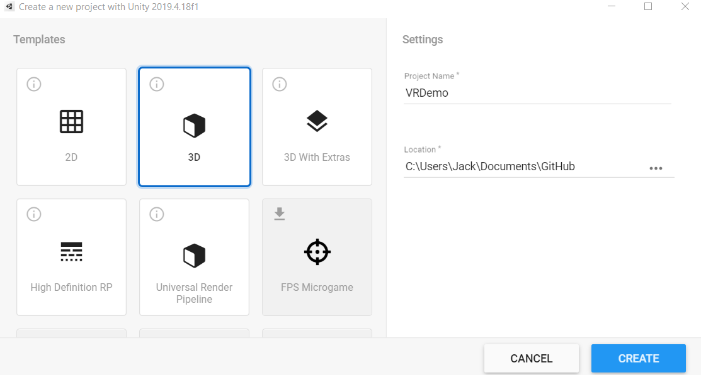
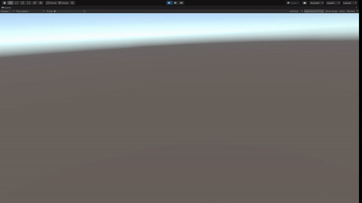
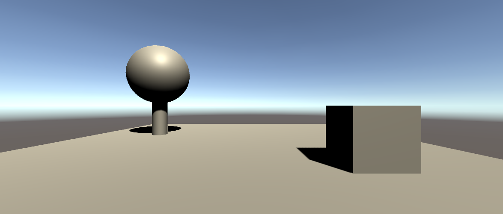

# 5. Virtual Reality in Unity

  

## Time for Some VR Fun!
Congrats on making it this far and hope you enjoyed making your own dancing avatar! Now we can dive into the part you are mostly excited about: Virtual Reality! The good news is: Unity has a very nice and easy VR integration for developers like you and me, and here is how.

## Setting up VR in Unity
### 1. Start a new Unity project
By now you should have an idea on how to create a new Unity project. Just in case if you forgot, check out [the tutorial here.](IntroductionToUnity.md). Open Unity Hub, select "New", and create a 3D project. I'm going name mine "VRDemo".

 

### 2. Enable VR in Unity
Next, follow this [offical guide](https://learn.unity.com/tutorial/enabling-vr-1#5fd69c9cedbc2a1685e10ed5) provided by Unity to enable VR in your project. Once you're done, if you put on your VR headset, you should be able to rotate your head and see the scene. Something like this: 

.

 

### 3. Challenge: Develop the scene a bit more!
Great job on making your first VR project! How do you like it? Well, you might find it a little empty. Drawing from your knowledge of creating a scene from the last mini-challenge, let's make a scene that is more interesting! Feel free to get creative with it.

*Hint: Don't forget to place the camera above the ground plane so you are not floating in the air!*

 

### 4. Seeing your scene in VR
So here is my super simple scene consisted of a box and a tree made of a sphere and a cylinder.

.

Once your scene is done, put on your headset and witness the wonders you created! 

.

